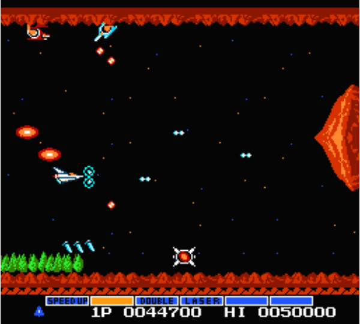

## React NES – Lightweight Famicom Emulator

**React NES** is a lightweight **Nintendo Entertainment System (NES)** emulator built with **TypeScript** and **React**. It is designed to balance **accuracy**, **performance**, and **simplicity**, enabling classic **iNES-format (`.nes`) ROMs** to run directly in a modern **web browser**.

This project focuses on clean architecture, incremental mapper support, and a clear visualization of emulator capabilities.

&emsp;&emsp;
&emsp;&emsp;

**Live Demo**: https://okb-99.github.io/react-nes/

---

## Features

- **Web-based NES emulation**
- Built with **React** and **TypeScript**
- Supports standard **iNES ROM format**
- Modular mapper architecture
- Clear visibility of supported vs unsupported mappers
- Lightweight and easy to extend

---

## Emulator Scope

The emulator aims to faithfully reproduce original NES hardware behavior, including:

- **CPU emulation** (6502-based)
- **PPU graphics rendering**
- **Memory mapping via iNES mappers**
- **ROM loading and execution in-browser**

Mapper support is implemented incrementally, with a clear roadmap.

---

## Supported & Planned iNES Mappers

Below is the current list of recognized **iNES mappers**, their **common designations**, and **implementation status**.

> Each mapper links to an external game compatibility list for reference.

---

### iNES Mapper Compatibility Table

| iNES Mapper | Status | Designations |
|------------|--------|--------------|
| Mapper0 ([games](https://nesdir.github.io/mapper0.html)) | **Available** | NROM |
| Mapper1 ([games](https://nesdir.github.io/mapper1.html)) | Not implemented | SxROM, MMC1 |
| Mapper2 ([games](https://nesdir.github.io/mapper2.html)) | **Available** | UxROM |
| Mapper3 ([games](https://nesdir.github.io/mapper3.html)) | **Available** | CNROM |
| Mapper4 ([games](https://nesdir.github.io/mapper4.html)) | Not implemented | TxROM, MMC3, MMC6 |
| Mapper5 ([games](https://nesdir.github.io/mapper5.html)) | Not implemented | ExROM, MMC5 |
| Mapper7 ([games](https://nesdir.github.io/mapper7.html)) | **Available** | AxROM |
| Mapper9 ([games](https://nesdir.github.io/mapper9.html)) | Not implemented | PxROM, MMC2 |
| Mapper10 ([games](https://nesdir.github.io/mapper10.html)) | Not implemented | FxROM, MMC4 |
| Mapper11 ([games](https://nesdir.github.io/mapper11.html)) | Not implemented | Color Dreams |
| Mapper13 ([games](https://nesdir.github.io/mapper13.html)) | Not implemented | CPROM |
| Mapper15 ([games](https://nesdir.github.io/mapper15.html)) | Not implemented | 100-in-1 Contra Function 16 |
| Mapper16 ([games](https://nesdir.github.io/mapper16.html)) | Not implemented | Bandai EPROM (24C02) |
| Mapper18 ([games](https://nesdir.github.io/mapper18.html)) | Not implemented | Jaleco SS8806 |
| Mapper19 ([games](https://nesdir.github.io/mapper19.html)) | Not implemented | Namco 163 |
| Mapper21 ([games](https://nesdir.github.io/mapper21.html)) | Not implemented | VRC4a, VRC4c |
| Mapper22 ([games](https://nesdir.github.io/mapper22.html)) | Not implemented | VRC2a |
| Mapper23 ([games](https://nesdir.github.io/mapper23.html)) | Not implemented | VRC2b, VRC4e |
| Mapper24 ([games](https://nesdir.github.io/mapper24.html)) | Not implemented | VRC6a |
| Mapper25 ([games](https://nesdir.github.io/mapper25.html)) | Not implemented | VRC4b, VRC4d |
| Mapper26 ([games](https://nesdir.github.io/mapper26.html)) | Not implemented | VRC6b |
| Mapper34 ([games](https://nesdir.github.io/mapper34.html)) | Not implemented | BNROM, NINA-001 |
| Mapper64 ([games](https://nesdir.github.io/mapper64.html)) | Not implemented | RAMBO-1 |
| Mapper66 ([games](https://nesdir.github.io/mapper66.html)) | Not implemented | GxROM, MxROM |
| Mapper68 ([games](https://nesdir.github.io/mapper68.html)) | Not implemented | After Burner |
| Mapper69 ([games](https://nesdir.github.io/mapper69.html)) | Not implemented | FME-7, Sunsoft 5B |
| Mapper71 ([games](https://nesdir.github.io/mapper71.html)) | Not implemented | Camerica / Codemasters |
| Mapper73 ([games](https://nesdir.github.io/mapper73.html)) | Not implemented | VRC3 |
| Mapper74 ([games](https://nesdir.github.io/mapper74.html)) | Not implemented | Pirate MMC3 derivative |
| Mapper75 ([games](https://nesdir.github.io/mapper75.html)) | Not implemented | VRC1 |
| Mapper76 ([games](https://nesdir.github.io/mapper76.html)) | Not implemented | Namco 109 variant |
| Mapper79 ([games](https://nesdir.github.io/mapper79.html)) | Not implemented | NINA-03, NINA-06 |
| Mapper85 ([games](https://nesdir.github.io/mapper85.html)) | Not implemented | VRC7 |
| Mapper86 ([games](https://nesdir.github.io/mapper86.html)) | Not implemented | JALECO-JF-13 |
| Mapper94 ([games](https://nesdir.github.io/mapper94.html)) | Not implemented | Senjou no Ookami |
| Mapper105 ([games](https://nesdir.github.io/mapper105.html)) | Not implemented | NES-EVENT |
| Mapper113 ([games](https://nesdir.github.io/mapper113.html)) | Not implemented | NINA-03 / NINA-06 |
| Mapper118 ([games](https://nesdir.github.io/mapper118.html)) | Not implemented | TxSROM, MMC3 |
| Mapper119 ([games](https://nesdir.github.io/mapper119.html)) | Not implemented | TQROM, MMC3 |
| Mapper159 ([games](https://nesdir.github.io/mapper159.html)) | Not implemented | Bandai EPROM (24C01) |
| Mapper166 ([games](https://nesdir.github.io/mapper166.html)) | Not implemented | SUBOR |
| Mapper167 ([games](https://nesdir.github.io/mapper167.html)) | Not implemented | SUBOR |
| Mapper180 ([games](https://nesdir.github.io/mapper180.html)) | Not implemented | Crazy Climber |
| Mapper185 ([games](https://nesdir.github.io/mapper185.html)) | Not implemented | CNROM with protection diodes |
| Mapper192 ([games](https://nesdir.github.io/mapper192.html)) | Not implemented | Pirate MMC3 derivative |
| Mapper206 ([games](https://nesdir.github.io/mapper206.html)) | Not implemented | DxROM, Namco 118, MIMIC-1 |
| Mapper210 ([games](https://nesdir.github.io/mapper210.html)) | Not implemented | Namco 175, Namco 340 |
| Mapper228 ([games](https://nesdir.github.io/mapper228.html)) | Not implemented | Action 52 |
| Mapper232 ([games](https://nesdir.github.io/mapper232.html)) | Not implemented | Camerica / Codemasters Quattro |

---

## Roadmap

Planned improvements include:

- **MMC1 / MMC3 implementation**
- Expanded audio support (APU accuracy)
- Save RAM support
- Improved timing and cycle accuracy
- Mobile input support

---

## Disclaimer

This project is intended for **educational and technical exploration purposes only**. Users are responsible for ensuring they own the rights to any ROMs they load.

---

## Contributing

Contributions are welcome, especially for:

- Mapper implementations
- Accuracy improvements
- Performance optimizations
- Documentation enhancements

---

## License

License information should be added here once finalized.
